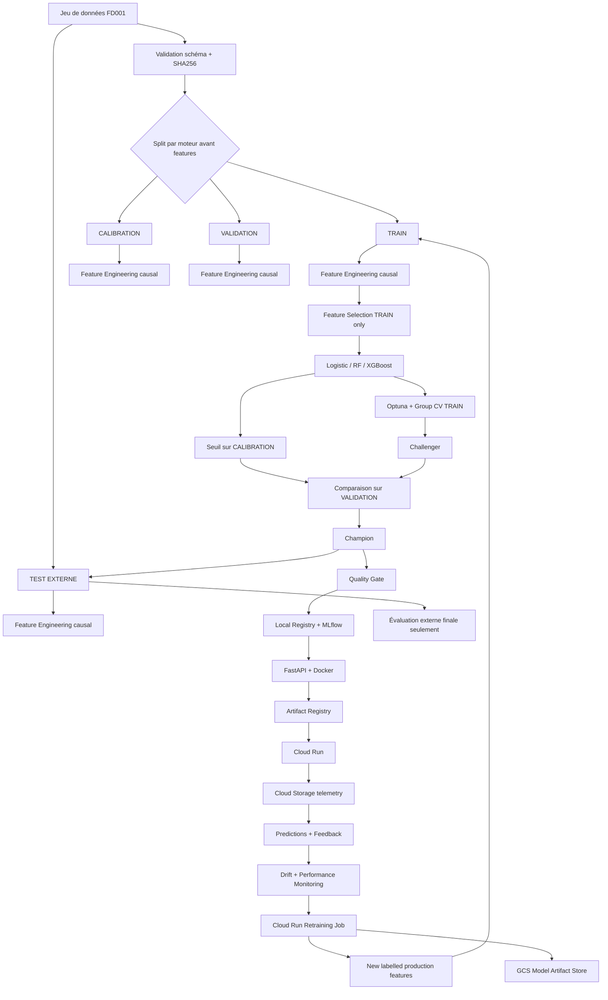

# Architecture technique

## Séparation des responsabilités

- **Data pipeline** : validation, labellisation, split, features.
- **ML pipeline** : sélection, entraînement, tuning, calibration, promotion.
- **Serving** : API stateless, modèle versionné, contrat Pydantic.
- **Observabilité** : métriques service, drift, performance différée.
- **Lifecycle** : feedback -> dataset additionnel -> retraining -> registry.
- **Cloud** : identité deployer/runtime/trainer/scheduler séparée.
